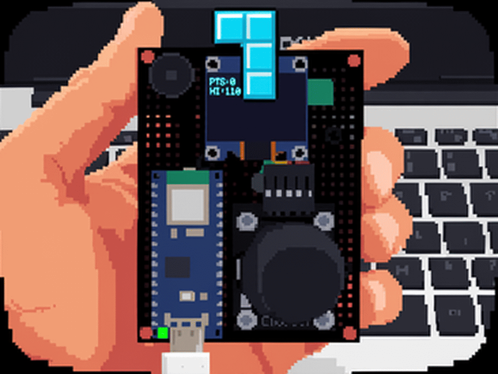

# Nano ESP32 

## 🎮 Retro Tetris Handheld - DFRobot + Nano ESP32

Zbudowałem wraz z grupą przyjacół małą konsolkę na płytce prototypowej z joystickiem i OLED 0.96" SSD1306.

<p align="center">
  
</p>

- **MCU:** Arduino Nano ESP32
- **Wyświetlacz:** OLED SSD1306 128x64 (PTS:0 HI:110)
- **Sterowanie:** Analog joystick lub przyciski
- **Styl:** 16-bit pixel art, CRT effect


Projekt jest realizowany w ramach eksperymentu z mikrokontrolerem Arduino Nano ESP32 oraz środowiskiem PlatformIO. Celem jest stworzenie klasycznej gry Tetris uruchamianej na małym wyświetlaczu OLED, z prostym sterowaniem i dodatkowymi funkcjami rozszerzającymi doświadczenie użytkownika.

## Opis projektu
Nano ESP32 Tetris to gra logiczna oparta na mechanice klasycznego Tetrisa, uruchomiona na płytce Arduino Nano ESP32. Projekt jest rozwijany jako przykład połączenia sprzętu embedded z prostym interfejsem WWW oraz obsługą lokalnego Wi‑Fi.

## Aktualny stan rozwoju
Projekt jest w trakcie rozwoju. Obecnie wspierane są:
- logika gry Tetris na wyświetlaczu OLED,
- sterowanie joystickiem lub alternatywnie zestawem przycisków,
- możliwość wstrzymania i wznowienia gry,
- zapis najlepszego wyniku do pamięci EEPROM,
- podstawowe efekty dźwiękowe,
- sygnalizacja usunięcia pełnej linii za pomocą diody LED,
- lokalne Wi-Fi i serwer WWW do zdalnego sterowania,
- ekran `GAME OVER` z prezentacją końcowego wyniku,
- ponowne uruchamianie gry przyciskiem obrotu lub przyciskiem `Start Game` w panelu WWW,
- wysyłanie końcowego wyniku do Google Sheets przez HTTPS,
- identyfikacja gracza przez `PLAYER_ID`,
- automatyczna identyfikacja konsoli przez `DEVICE_ID`.

## Sprzęt
- Arduino Nano ESP32
- Wyświetlacz OLED SSD1306 128x64
- Joystick analogowy 2-axis
- Alternatywnie: cztery przyciski sterujące oraz przycisk pauzy
- Buzzer
- Płytka prototypowa / przewody

## Sterowanie

### Wariant joystickowy
- Lewo / Prawo: ruch klocka w poziomie
- Dół: przyspieszenie spadania
- Przycisk joysticka: obrót klocka

### Wariant z przyciskami
- Lewo: przesunięcie klocka w lewo
- Prawo: przesunięcie klocka w prawo
- Dół: przyspieszenie spadania
- Obrót: obrót klocka
- Pauza: wstrzymanie lub wznowienie gry

## Funkcje
- mechanika gry Tetris,
- punktacja i usuwanie pełnych linii,
- zapis najwyższego wyniku,
- podgląd następnego klocka,
- obsługa dźwięków,
- ustawienia poziomów trudności,
- pauza i wznowienie rozgrywki,
- lokalne Wi-Fi z panelem WWW,
- zdalne sterowanie ruchem, obrotem i przyspieszeniem opadania,
- zdalny restart po zakończeniu gry,
- rejestracja wyniku w arkuszu Google Sheets,
- trwałe przechowywanie identyfikatora gracza w pamięci ESP32.

## Szczegóły rozgrywki
- plansza gry ma wymiary `10 × 20` pól,
- dostępnych jest 7 rodzajów klocków,
- za każdą usuniętą linię przyznawane jest 10 punktów,
- poziom zwiększa się automatycznie po usunięciu każdych 10 linii,
- wraz ze wzrostem poziomu skraca się czas opadania klocków,
- po wykryciu kolizji przy tworzeniu nowego klocka gra przechodzi do stanu `GAME OVER`,
- w stanie `GAME OVER` rozgrywka jest zatrzymana do czasu uruchomienia nowej gry,
- końcowy wynik jest wysyłany jednokrotnie do Google Sheets,
- po ponownym uruchomieniu plansza, wynik, liczba linii, poziom i interwał opadania są resetowane.

Na ekranie OLED wyświetlane są aktualny wynik (`PTS`), najlepszy wynik (`HI`),
poziom (`L`) oraz podgląd kolejnego klocka (`NEXT`).

## Połączenia sprzętowe
| Element | Pin / interfejs |
| --- | --- |
| Joystick, oś pionowa | `A0` |
| Joystick, oś pozioma | `A1` |
| Przycisk joysticka | `A2` |
| Buzzer | `D8` |
| Dioda LED | `D2` |
| OLED SSD1306 | I2C, adres `0x3C` |

### Wariant z przyciskami

| Funkcja | Pin |
| --- | --- |
| Lewo | `D4` |
| Prawo | `D5` |
| Dół | `D6` |
| Obrót | `D7` |
| Pauza | `D9` |

## Wi-Fi i panel WWW
Do konfiguracji połączenia używany jest WiFiManager. Przy braku zapisanej
konfiguracji urządzenie uruchamia sieć konfiguracyjną `Tetris_Setup`.
Po połączeniu z domową siecią adres urządzenia można odczytać w monitorze
szeregowym. Panel WWW jest serwowany z systemu plików LittleFS na porcie `80`.

Panel umożliwia sterowanie grą z przeglądarki: ruchem w lewo i w prawo,
obrotem oraz przyspieszeniem opadania. Polecenia są wysyłane przez endpoint:

```text
/action?go=left
/action?go=right
/action?go=rotate
/action?go=drop
/action?go=start
```

Polecenie `start` uruchamia nową rozgrywkę wyłącznie w stanie `GAME OVER`.
Przycisk `OBROT` zachowuje funkcję obrotu klocka podczas normalnej gry, a fizyczny
przycisk obrotu uruchamia nową rozgrywkę po zakończeniu poprzedniej.

Panel WWW zawiera również sekcję identyfikacji gracza. Użytkownik wpisuje tam
`PLAYER_ID`, a następnie zapisuje go przyciskiem. Identyfikator jest przechowywany
w pamięci trwałej ESP32, więc pozostaje po restarcie i odłączeniu zasilania.
Panel pokazuje także automatycznie wygenerowany `DEVICE_ID` konkretnej konsoli.

## Integracja z Google Sheets
Po przejściu gry do stanu `GAME OVER` firmware wysyła jednokrotnie żądanie HTTPS
do wdrożonej aplikacji Google Apps Script. Przekazywane są parametry:

- `score` – końcowa liczba punktów,
- `player_id` – zapisany identyfikator gracza,
- `device_id` – automatyczny identyfikator konsoli.

Aplikacja Apps Script dopisuje dane do karty `Wyniki_v2` w kolumnach:

```text
DATA | PLAYER_ID | DEVICE_ID | WYNIK
```

Przykładowy wpis może wyglądać tak:

```text
2026-09-17 18:42 | P-0042 | ESP32-A1B2C3 | 350
```

Dotychczasowy arkusz może pozostać aktywny dla starszych urządzeń, a `Wyniki_v2`
może równolegle przyjmować wyniki z urządzeń z nowym firmware'em. Dzięki temu
identyfikacja może być wdrażana stopniowo, bez usuwania wcześniejszych wyników.

Do obsługi transmisji wykorzystywane są biblioteki `HTTPClient` oraz
`WiFiClientSecure` dostępne w frameworku Arduino dla ESP32. Firmware obsługuje
również przekierowania HTTP stosowane przez wdrożenia Google Apps Script.

Adres wdrożenia nie jest przechowywany w dokumentacji publicznej. Jest zapisany
w konfiguracji firmware urządzenia.

## Efekty i pamięć
- obrót klocka, usunięcie linii i zakończenie gry sygnalizowane są dźwiękiem,
- dioda LED pozostaje zgaszona podczas normalnej rozgrywki,
- po uzupełnieniu i usunięciu pełnej linii dioda LED zapala się na krótką chwilę,
- najlepszy wynik jest zapisywany w EEPROM i zachowywany po restarcie urządzenia.

## Środowisko i zależności
Projekt jest przygotowany pod PlatformIO i wykorzystuje:
- framework Arduino dla ESP32,
- biblioteki Adafruit GFX i Adafruit SSD1306,
- LittleFS do obsługi plików strony WWW,
- WiFi oraz WebServer,
- HTTPClient oraz WiFiClientSecure do komunikacji HTTPS.

## Jak uruchomić
1. Otwórz projekt w PlatformIO.
2. Wgraj firmware do płyty:
   ```bash
   pio run --target upload --environment arduino_nano_esp32
   ```
3. Jeśli chcesz użyć obsługi plików strony WWW, wgraj również system plików (LittleFS).
   Najpierw zbuduj obraz systemu plików, następnie go wgraj:
   ```bash
   pio run --target buildfs --environment arduino_nano_esp32
   pio run --target uploadfs --environment arduino_nano_esp32
   ```

   W PowerShell (jeśli używasz wbudowanego środowiska PlatformIO):
   ```powershell
   .\.platformio\penv\Scripts\platformio.exe run --target buildfs --environment arduino_nano_esp32
   .\.platformio\penv\Scripts\platformio.exe run --target uploadfs --environment arduino_nano_esp32
   ```
4. Po uruchomieniu płyty połącz się z siecią Wi‑Fi utworzoną przez urządzenie (jeśli funkcja jest aktywna) i otwórz adres IP podany w monitorze szeregowym.
5. Otwórz panel WWW, ustaw `PLAYER_ID` i kliknij `Zapisz`.
6. Przetestuj przejście do `GAME OVER`, restart przyciskiem fizycznym oraz restart
   przyciskiem `Start Game` w panelu WWW. Następnie sprawdź, czy wynik został
   dopisany do `Wyniki_v2` wraz z `PLAYER_ID` i `DEVICE_ID`.

Po zmianie wyłącznie firmware wystarczy wykonać `upload`. Po zmianie plików
w katalogu `data/` należy dodatkowo wykonać `uploadfs`.

## Struktura projektu
- `src/main.cpp` – główna logika gry, sterowanie oraz obsługa Wi‑Fi/WWW
- `data/` – pliki strony internetowej (`index.html`, `style.css`)
- `platformio.ini` – konfiguracja projektu PlatformIO

## Uwagi
Projekt jest nadal rozwijany. Dostęp aplikacji Google Apps Script ustawiony jako
publiczny (`Anyone`) umożliwia urządzeniu dopisywanie wyników bez logowania.
W środowisku produkcyjnym należy rozważyć dodatkowy token autoryzacyjny oraz
walidację parametrów po stronie Apps Script.
